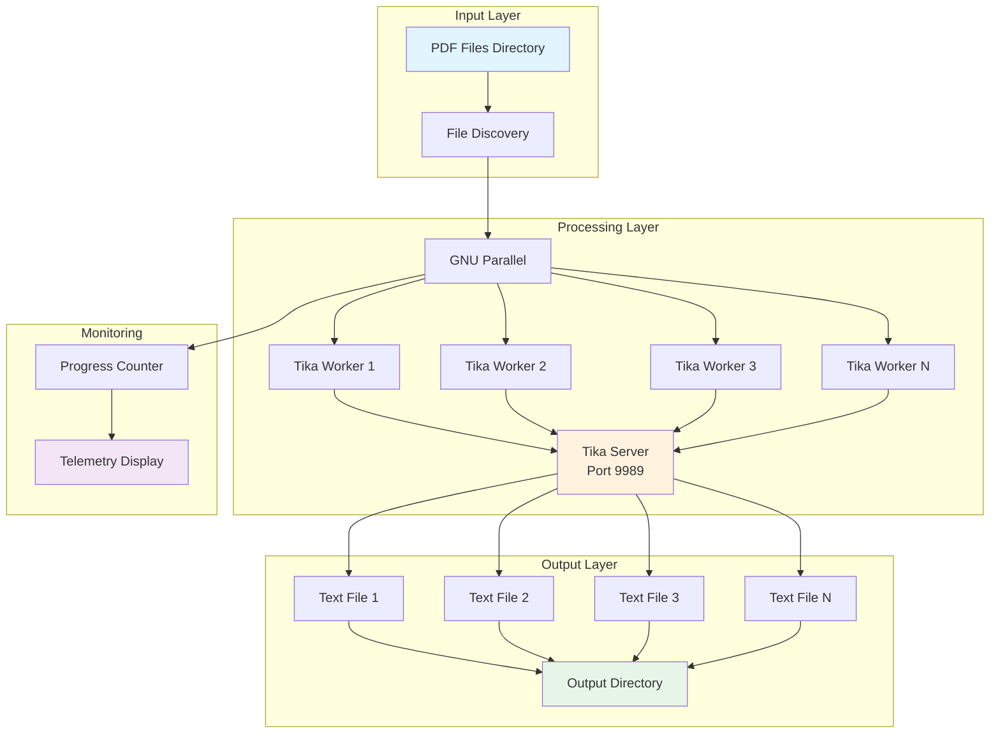
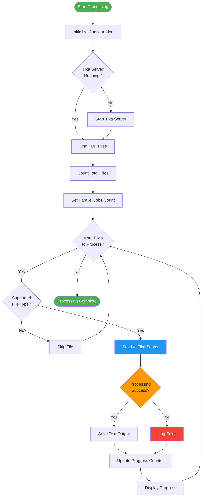
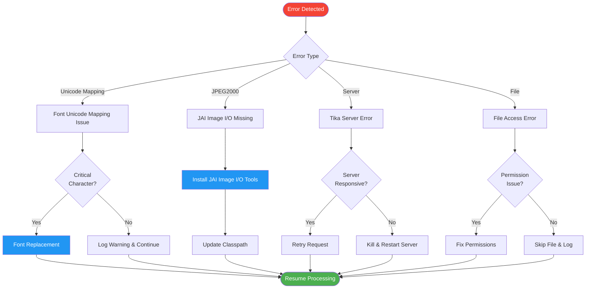
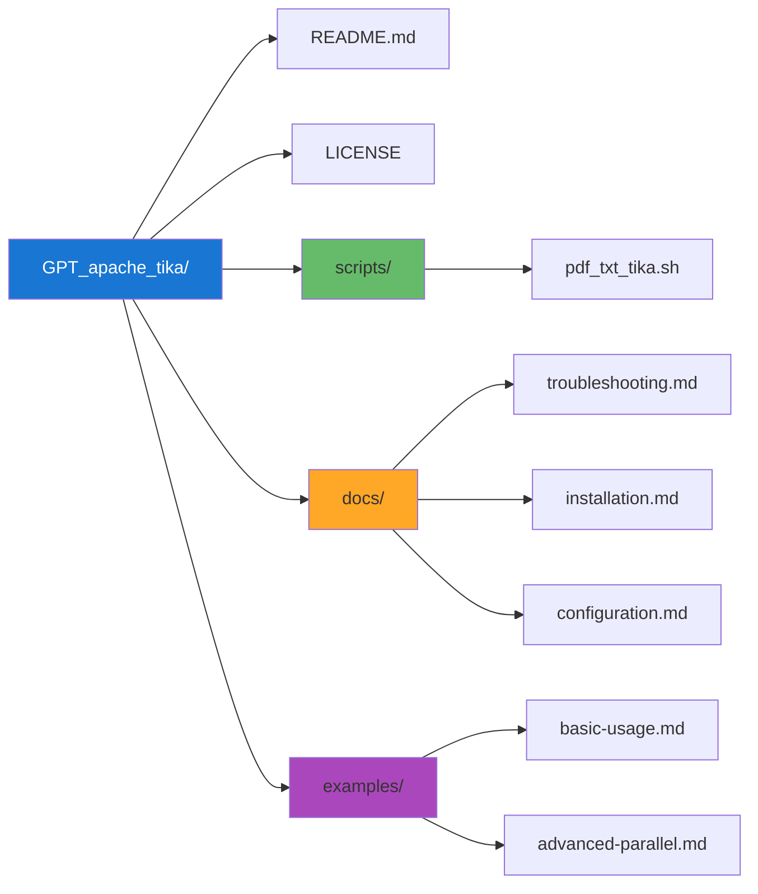
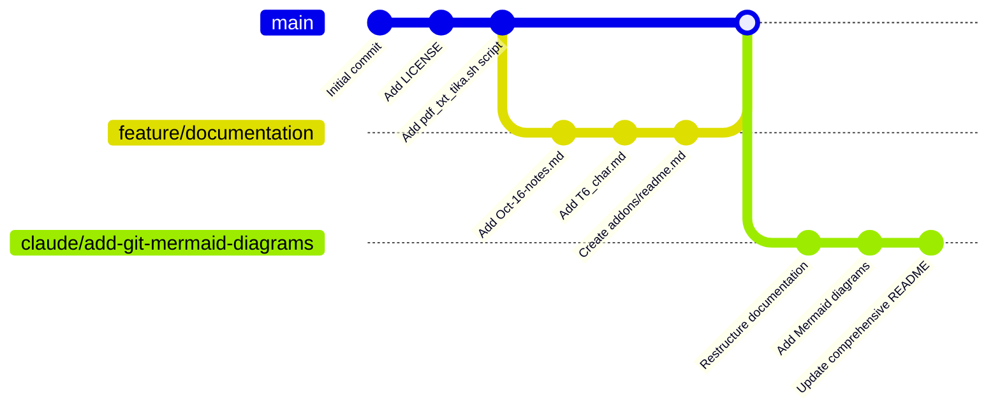
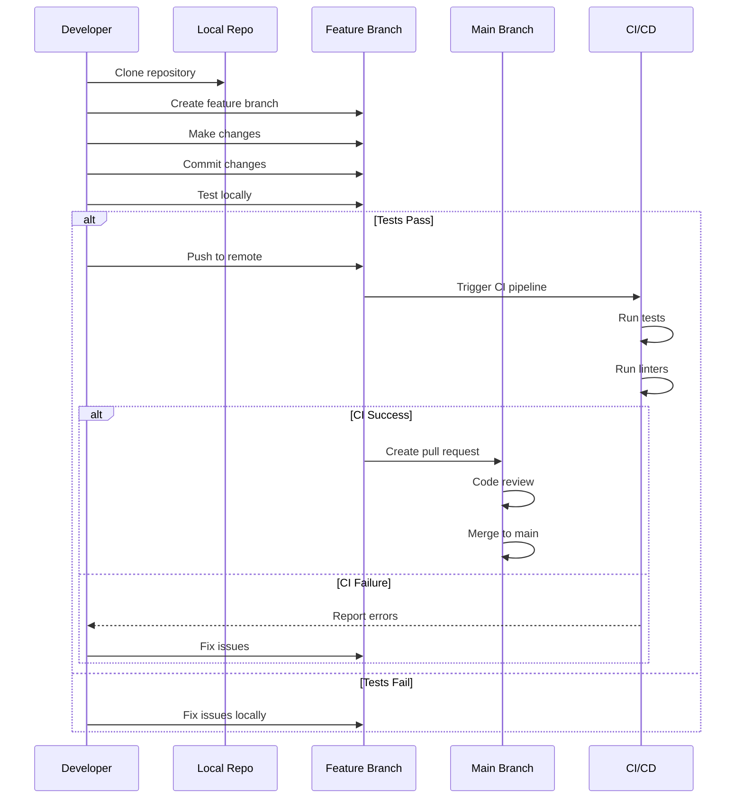

# GPT Apache Tika

A comprehensive guide and toolkit for running Apache Tika in parallel to convert PDFs and other documents to text files on Ubuntu systems, with GPT-assisted troubleshooting and optimization.

## Table of Contents

- [Overview](#overview)
- [Architecture](#architecture)
- [Repository Structure](#repository-structure)
- [Prerequisites](#prerequisites)
- [Installation](#installation)
- [Usage](#usage)
- [Workflow Diagrams](#workflow-diagrams)
- [Troubleshooting](#troubleshooting)
- [Contributing](#contributing)
- [License](#license)

## Overview

This project provides scripts, documentation, and best practices for efficiently processing large batches of PDF files using Apache Tika on Ubuntu 22.04. It leverages parallel processing with GNU Parallel to maximize throughput and includes extensive troubleshooting guides for common issues.

**Key Features:**
- Parallel PDF to text conversion using Apache Tika
- Configurable parallel processing with GNU Parallel
- Progress monitoring and telemetry
- Comprehensive error handling and recovery
- Solutions for common font encoding and Unicode mapping issues

## Architecture

### System Architecture



### Processing Workflow



### Error Handling Flow



## Repository Structure



### Current Files

- **README.md** - This file, main project documentation
- **LICENSE** - Project license (Apache 2.0 or similar)
- **pdf_txt_tika.sh** - Main bash script for parallel PDF processing
- **Oct-16-notes.md** - Historical notes on Tika usage and troubleshooting
- **T6_char.md** - Notes on T6 font character mapping warnings
- **addons/readme.md** - PDFBox warnings and solutions documentation

## Prerequisites

- Ubuntu 22.04 (or similar Debian-based Linux distribution)
- Java Runtime Environment (JRE) 8 or higher
- Apache Tika 2.9.1 or later
- GNU Parallel
- curl
- Sufficient disk space for output files

## Installation

### 1. Install Java

```bash
sudo apt update
sudo apt install default-jre
java -version
```

### 2. Install Apache Tika

**Option A: Using apt (recommended for standard use):**

```bash
sudo apt update
sudo apt install apache-tika
```

**Option B: Manual installation (for specific versions):**

```bash
# Download Tika
wget https://archive.apache.org/dist/tika/2.9.1/tika-app-2.9.1.jar

# Make it executable
chmod +x tika-app-2.9.1.jar

# Optional: Move to a standard location
sudo mkdir -p /opt/tika
sudo mv tika-app-2.9.1.jar /opt/tika/
```

### 3. Install GNU Parallel

```bash
sudo apt update
sudo apt install parallel
```

### 4. Install JAI Image I/O Tools (for JPEG2000 support)

**Option A: Maven project:**

Add to your `pom.xml`:

```xml
<dependency>
    <groupId>com.github.jai-imageio</groupId>
    <artifactId>jai-imageio-core</artifactId>
    <version>1.4.0</version>
</dependency>
<dependency>
    <groupId>com.github.jai-imageio</groupId>
    <artifactId>jai-imageio-jpeg2000</artifactId>
    <version>1.4.0</version>
</dependency>
```

**Option B: Manual installation:**

```bash
# Download JAR files and add to classpath when running Tika
java -cp 'tika-app-2.9.1.jar:jai-imageio-core-1.4.0.jar:jai-imageio-jpeg2000-1.4.0.jar' \
    org.apache.tika.cli.TikaCLI -t input.pdf > output.txt
```

## Usage

### Basic Usage

**Single file conversion:**

```bash
java -jar tika-app-2.9.1.jar -t input.pdf > output.txt
```

**Extract metadata:**

```bash
java -jar tika-app-2.9.1.jar -m input.pdf
```

### Parallel Processing

**Using the provided script:**

```bash
# Edit the script to configure directories
nano pdf_txt_tika.sh

# Set input and output directories
# input_dir="your/input_dir/"
# output_dir="your/output_dir/"

# Run the script
./pdf_txt_tika.sh
```

**Manual parallel processing:**

```bash
# Basic parallel conversion
find /path/to/pdfs/ -name "*.pdf" | \
    parallel "java -jar tika-app-2.9.1.jar -t {} > {/.}.txt"

# With specific number of jobs (4 CPU cores)
find /path/to/pdfs/ -name "*.pdf" | \
    parallel -j 4 "java -jar tika-app-2.9.1.jar -t {} > {/.}.txt"

# With progress bar
find /path/to/pdfs/ -name "*.pdf" | \
    parallel -j 4 --bar "java -jar tika-app-2.9.1.jar -t {} > {/.}.txt"

# Save to specific output directory
find /path/to/pdfs/ -name "*.pdf" | \
    parallel -j 4 "java -jar tika-app-2.9.1.jar -t {} > /output/dir/{/.}.txt"
```

### Using Tika Server

**Start the server:**

```bash
java -jar tika-app-2.9.1.jar --server --port 9989
```

**Send files using curl:**

```bash
curl -T input.pdf http://localhost:9989/tika > output.txt
```

### Advanced Options

**Increase Java heap size for large files:**

```bash
java -Xmx4g -jar tika-app-2.9.1.jar -t large-file.pdf > output.txt
```

**Extract text from main content only:**

```bash
java -jar tika-app-2.9.1.jar -T input.pdf > output.txt
```

**Output in JSON format:**

```bash
java -jar tika-app-2.9.1.jar -j input.pdf > output.json
```

## Workflow Diagrams

### Git Branching Strategy



### Development Workflow



## Troubleshooting

### Common Issues and Solutions

#### 1. Unicode Mapping Warnings

**Issue:** `No Unicode mapping for X in font Y`

**Solution:**
- Usually non-critical - check if extracted text is acceptable
- For critical characters, consider font replacement or PDF regeneration
- See [T6_char.md](T6_char.md) for detailed analysis

#### 2. JPEG2000 Image Errors

**Issue:** `Cannot read JPEG2000 image: Java Advanced Imaging (JAI) Image I/O Tools are not installed`

**Solution:**
```bash
# Install JAI Image I/O Tools (see Installation section)
# Update classpath when running Tika
java -cp 'tika-app-2.9.1.jar:jai-imageio-core-1.4.0.jar:jai-imageio-jpeg2000-1.4.0.jar' \
    org.apache.tika.cli.TikaCLI -t input.pdf > output.txt
```

#### 3. Out of Memory Errors

**Issue:** `OutOfMemoryError` when processing large PDFs

**Solution:**
```bash
# Increase Java heap size
java -Xmx4g -jar tika-app-2.9.1.jar -t large-file.pdf > output.txt

# For very large files, consider increasing even more
java -Xmx8g -jar tika-app-2.9.1.jar -t very-large-file.pdf > output.txt
```

#### 4. Character Encoding Issues

**Issue:** Extracted text contains garbled characters

**Solution:**
```bash
# Specify output encoding
java -jar tika-app-2.9.1.jar -t -eUTF-8 input.pdf > output.txt
```

#### 5. Tika Server Not Responding

**Issue:** Server hangs or doesn't respond

**Solution:**
```bash
# Kill the server process
pkill -f "tika-app.*--server"

# Restart with increased timeout
java -jar tika-app-2.9.1.jar --server --port 9989 -timeout=300000
```

### Performance Optimization

**Optimal parallel jobs:**
```bash
# Use number of CPU cores
nproc  # Check your CPU count
find . -name "*.pdf" | parallel -j $(nproc) "java -jar tika-app-2.9.1.jar -t {} > {/.}.txt"
```

**Monitor system resources:**
```bash
# While processing, monitor in another terminal
htop
# or
watch -n 1 "ps aux | grep tika"
```

## Contributing

Contributions are welcome! Please feel free to submit pull requests or open issues for:
- Bug fixes
- Performance improvements
- Documentation enhancements
- New features or scripts
- Troubleshooting solutions

## License

This project is licensed under the terms specified in the [LICENSE](LICENSE) file.

## Additional Resources

- [Apache Tika Official Documentation](https://tika.apache.org/)
- [GNU Parallel Tutorial](https://www.gnu.org/software/parallel/parallel_tutorial.html)
- [PDFBox Documentation](https://pdfbox.apache.org/)

---

**Project maintained by:** GPT-assisted development
**Last updated:** 2025-11-14
